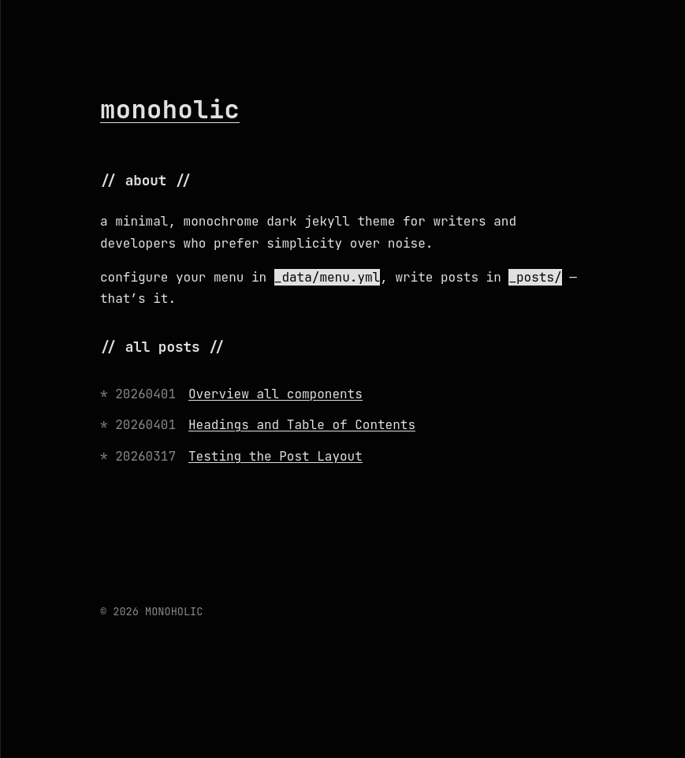

# Monoholic

[](https://www.gnu.org/licenses/gpl-3.0.txt)
[](https://github.com/stiermid/monoholic/releases)
[](https://rubygems.org/gems/monoholic)
[](https://rubygems.org/gems/monoholic)
[](https://stiermid.github.io/monoholic)

A minimal, monochrome dark Jekyll theme🧪

<h3 align="center"><a href="https://stiermid.github.io/monoholic">Try the demo out!</a></h3>



## Features

- **Minimalist Dark Aesthetic:** Sleek, high-contrast monochrome design out of the box.
- **Data-Driven Menu:** Easily configure your site navigation via `_data/menu.yml`.
- **Developer Friendly:** Code syntax highlighting and monospace typography (JetBrains Mono).
- **Responsive Design:** Mobile-first layout with smooth fluid scaling using modern CSS.
- **Customizable:** Centralized CSS variables for fast theming.
- **SEO & RSS Ready:** Built-in support for `jekyll-seo-tag` and `jekyll-feed`.
- **Per-Page Scripts:** Add specific JavaScript to individual pages seamlessly.

## Installation

### Using RubyGems

1. Add this line to your Jekyll site's `Gemfile`:

```ruby
gem "monoholic"
```

2. Add this line to your Jekyll site's `_config.yml`:

```yaml
theme: monoholic
```

3. Execute:

```bash
$ bundle install
```

### Manual Installation

If you're running Jekyll without RubyGems or prefer to use GitHub Pages remote themes, update your `_config.yml`:

```yaml
remote_theme: stiermid/monoholic
```

Or, simply fork this repository, adapt the `_config.yml` according to your needs, and you're good to go!

## Usage

### Basic Setup

Once installed, build your site using the provided layouts (`default`, `home`, `page`, `post`).

### Configuration

Override the default settings in your `_config.yml`. Key theme configuration options:

```yaml
theme_config:
  back: ".." # Text for backlink on post pages
  date_format: "%Y%m%d" # Date format for post metadata
```

### Menu Configuration

Monoholic uses a data-driven approach to its menu. Create or edit `_data/menu.yml` to define your site's navigation structure.

Example `_data/menu.yml`:

```yaml
entries:
  - title: about
    content: |
      <p>Your about me text here.</p>

  - title: all posts
    post_list: true
```

- `title`: The section header.
- `content`: Custom HTML or text for the menu section.
- `post_list`: Set to `true` to auto-generate a list of your Jekyll posts under this section.

## Contributing

Bug reports and pull requests are welcome on GitHub at [https://github.com/stiermid/monoholic](https://github.com/stiermid/monoholic). This project is intended to be a safe, welcoming space for collaboration, and contributors are expected to adhere to the [Contributor Covenant](https://www.contributor-covenant.org/) code of conduct.

## License

This theme is available as open source under the terms of the [GNU General Public License v3.0 only](https://www.gnu.org/licenses/gpl.txt) (GPL-3.0-only).
